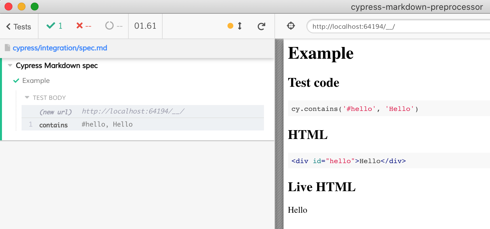

# cypress-markdown-preprocessor

[![ci status][ci image]][ci url] [![badges status][badges image]][badges url] [![renovate-app badge][renovate-badge]][renovate-app]  

> Use Markdown files as Cypress specs

Read [Write Cypress Markdown Preprocessor](https://glebbahmutov.com/blog/write-cypress-preprocessor/)

## Install

Assuming Cypress is a dev dependency

```
npm i -D cypress-markdown-preprocessor
# or
yarn add -D cypress-markdown-preprocessor
```

Add to your Cypress plugins file

```js
// cypress/plugins/index.js
const mdPreprocessor = require('cypress-markdown-preprocessor')
module.exports = (on, config) => {
  on('file:preprocessor', mdPreprocessor)
}
```

Set the [`testFiles`](https://on.cypress.io/configuration) to use Markdown files as specs

```json
{
  "testFiles": "*.md"
}
```

## Use

Write Markdown spec files including "fiddle" comments. Each fiddle comment will be extracted into own test.

    <!-- fiddle Example -->
    ```html
    <div id="hello">Hello</div>
    ```

    ```js
    cy.contains('#hello', 'Hello')
    ```
    <!-- fiddle.end -->

The "html" block is optional.



Note: after extracting the tests, this preprocessor sets [@cypress/fiddle](https://github.com/cypress-io/cypress-fiddle) to run them.

### Suites

To create suites of tests, use `/` to separate the suite name from the test name. Tests with the same suite name are grouped together automatically.

    <!-- fiddle TodoMVC / loads -->
    ```js
    cy.visit('/')
    ```
    <!-- fiddle-end -->

    then some time later

    <!-- fiddle TodoMVC / adds items -->
    ```js
    cy.visit('/')
    cy.get('.new-todo').type('write tests{enter}')
    ```
    <!-- fiddle-end -->

### Skipping JavaScript blocks

You can skip JS blocks in the fiddle by using `js skip` syntax

````
    ```js skip
    // this JavaScript block won't be included in fiddle
    ```
````

## Exporting JS specs from Markdown fiddles

```shell
# saves path/to/md.js file
npx export-fiddle <path/to/md>
# adds optional "beforeEach" hook with cy.visit(url)
npx export-fiddle <path/to/md> --before-each <url>
# adds optional "before" hook with cy.visit(url)
npx export-fiddle <path/to/md> --before <url>
```

## Examples

See the presentation [Using End-to-end Tests as Documentation](https://slides.com/bahmutov/tests-are-docs)

- [cypress-book-todomvc](https://github.com/bahmutov/cypress-book-todomvc)
- [cypress-examples](https://github.com/bahmutov/cypress-examples)

## Debugging

To see log messages from this module, run with `DEBUG=cypress-markdown-preprocessor` environment variable. To see ever more debug messages enable the verbose logging `DEBUG=cypress-markdown-preprocessor,cypress-markdown-preprocessor:verbose`.

## Small print

Author: Gleb Bahmutov &lt;gleb.bahmutov@gmail.com&gt; &copy; 2020

- [@bahmutov](https://twitter.com/bahmutov)
- [glebbahmutov.com](https://glebbahmutov.com)
- [blog](https://glebbahmutov.com/blog)

License: MIT - do anything with the code, but don't blame me if it does not work.

Support: if you find any problems with this module, email / tweet /
[open issue](https://github.com/bahmutov/cypress-markdown-preprocessor/issues) on Github

## MIT License

Copyright (c) 2020 Gleb Bahmutov &lt;gleb.bahmutov@gmail.com&gt;

Permission is hereby granted, free of charge, to any person
obtaining a copy of this software and associated documentation
files (the "Software"), to deal in the Software without
restriction, including without limitation the rights to use,
copy, modify, merge, publish, distribute, sublicense, and/or sell
copies of the Software, and to permit persons to whom the
Software is furnished to do so, subject to the following
conditions:

The above copyright notice and this permission notice shall be
included in all copies or substantial portions of the Software.

THE SOFTWARE IS PROVIDED "AS IS", WITHOUT WARRANTY OF ANY KIND,
EXPRESS OR IMPLIED, INCLUDING BUT NOT LIMITED TO THE WARRANTIES
OF MERCHANTABILITY, FITNESS FOR A PARTICULAR PURPOSE AND
NONINFRINGEMENT. IN NO EVENT SHALL THE AUTHORS OR COPYRIGHT
HOLDERS BE LIABLE FOR ANY CLAIM, DAMAGES OR OTHER LIABILITY,
WHETHER IN AN ACTION OF CONTRACT, TORT OR OTHERWISE, ARISING
FROM, OUT OF OR IN CONNECTION WITH THE SOFTWARE OR THE USE OR
OTHER DEALINGS IN THE SOFTWARE.

[ci image]: https://github.com/bahmutov/cypress-markdown-preprocessor/workflows/ci/badge.svg?branch=main
[ci url]: https://github.com/bahmutov/cypress-markdown-preprocessor/actions
[badges image]: https://github.com/bahmutov/cypress-markdown-preprocessor/workflows/badges/badge.svg?branch=main
[badges url]: https://github.com/bahmutov/cypress-markdown-preprocessor/actions
[renovate-badge]: https://img.shields.io/badge/renovate-app-blue.svg
[renovate-app]: https://renovateapp.com/
